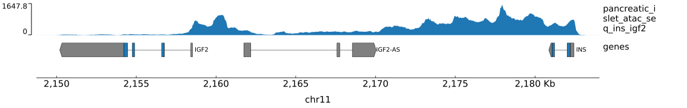

# gtracks

plot genome track data (for example from bigWig files)

## Installation

```sh
pip3 install gtracks
```
or
```sh
pip3 install --user gtracks
```

## Examples

To generate a test plot, you only need to provide the output filename.
```sh
gtracks test.svg
```


You can plot your own tracks over other genomic regions by providing more
arguments. The file type of the plot will be determined by the output file
extension. For more command-line options, see the usage page below.
```sh
gtracks chr11:2150341-2182439 track1.bw track2.bw output.pdf
gtracks INS track1.bw track2.bw output.png
```

If you want to use your own bigWig files but don't want to write out their
paths every time you run `gtracks`, you can set your own default tracks using
the environment variable `GTRACKS_TRACKS`.
```
export GTRACKS_TRACKS=track1.bw,track2.bw,track3.bw
gtracks output.svg
```

You can also change the default gene annotations file and color palette using
environment variables `GTRACKS_GENES_PATH` and `GTRACKS_COLOR_PALETTE`.

## Usage

```
usage: gtracks [-h] [--genes <genes.bed.gz>]
               [--color-palette <#color> [<#color> ...]] [--max <float>]
               [--tmp-dir <temp/file/dir>] [--width <int>]
               [--genes-height <int>] [--gene-rows <int>]
               <{chr:start-end,GENE}> [<track.bw> [<track.bw> ...]]
               <path/to/output.{pdf,png,svg}

Plot bigWig signal tracks and gene annotations in a genomic region

positional arguments:
  <{chr:start-end,GENE}>
                        coordinates or gene name to plot
  <track.bw>            bigWig files containing tracks
  <path/to/output.{pdf,png,svg}>
                        path to output file

optional arguments:
  -h, --help            show this help message and exit
  --genes <genes.bed.gz>
                        compressed 6-column BED file or 12-column BED12 file
                        containing gene annotations
  --color-palette <#color> [<#color> ...]
                        color pallete for tracks
  --max <float>         max value of y-axis
  --tmp-dir <temp/file/dir>
                        directory for temporary files
  --width <int>         width of plot in cm
  --genes-height <int>  height of genes track
  --gene-rows <int>     number of gene rows
```
